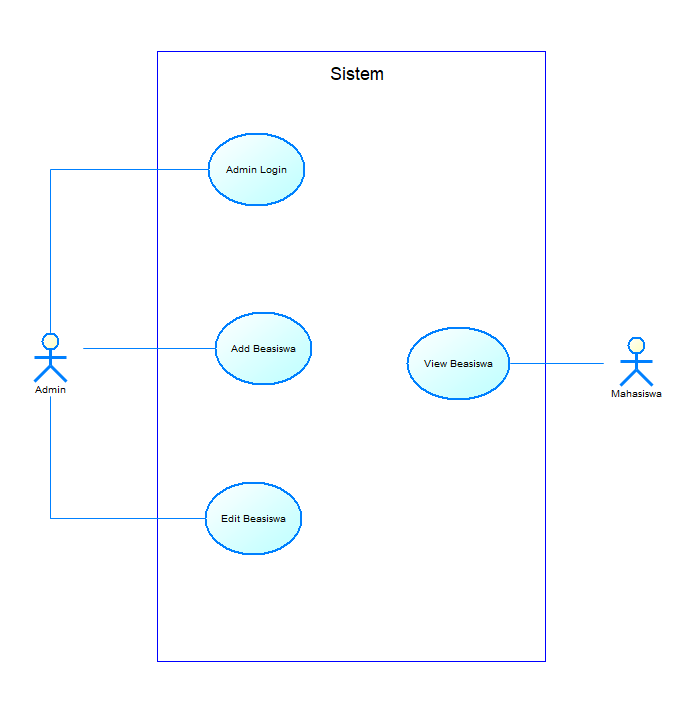
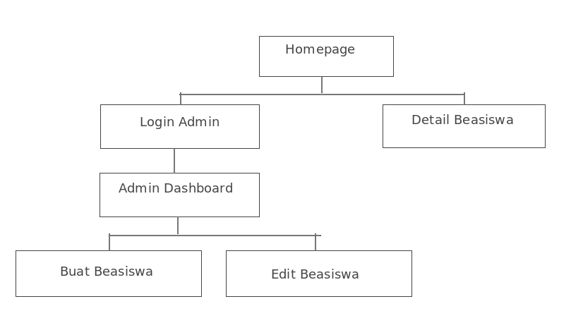
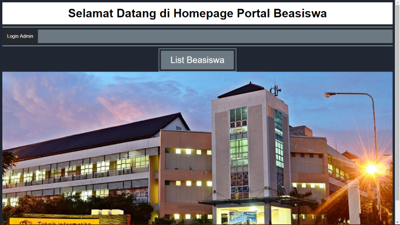
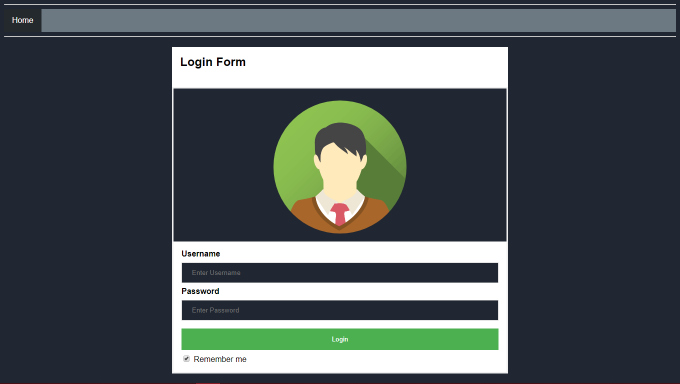
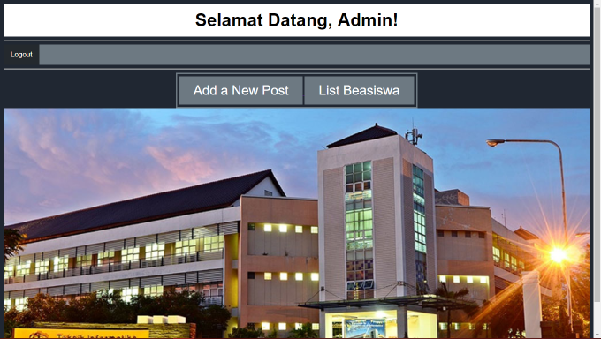

# Final Project Pemrograman Berbasis Kerangka Kerja

## Anggota
1. [Faturrahman M.](https://github.com/adadeeeh) 05111540000027
2. [Barep Bimo Pangestu](https://github.com/bosmobosmo) 05111540000112
3. [Dias Adhi Pratama](https://github.com/yaskeee) 05111540000173

## Kriteria Aplikasi
1. Memberikan solusi terhadap problem tertentu
2. Menggunakan Spring Framework
3. Terdapat komponen REST-API untuk digunakan oleh platform lain

## Nama Aplikasi
**Portal Informasi Beasiswa Informatika**

## Analisis
1. Perlunya portal informasi beasiswa yang dibuka untuk jurusan informatika.
2. Portal memberikan informasi berupa tanggal pendaftaran, syarat pendaftaran, dan tanggal pengumuman beasiswa.

## Deskripsi
1. Sebuah halaman utama yang menampilkan nama beasiswa yang sedang membuka pendaftaran.
2. Sebuah halaman yang menampilkan detail beasiswa yang sedang membuka pendaftaran.

## Use Case Aplikasi
### Aktor
1. Admin
2. Mahasiswa

### Use Case
1. **Admin Login** : Login sebagai admin
2. **Add Beasiswa** : Menambahkan Postingan Beasiswa
3. **Edit Beasiswa** : Mengubah Postingan Beasiswa
4. **View Beasiswa** : Melihat Postingan Beasiswa

### Use Case Diagram

## Sitemap

## Screenshot Page
### Halaman Homepage

### Halaman Login Admin

### Halaman Homepage Admin

### Halaman Add Beasiswa
.PNG)

### Halaman View Beasiswa(Admin)
.PNG)

### Halaman Edit Beasiswa(Admin)
.PNG)

### Halaman View Beasiswa(Mahasiswa)
.PNG)
